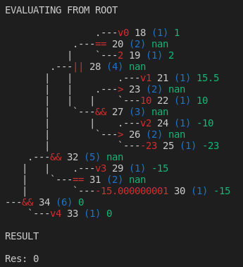
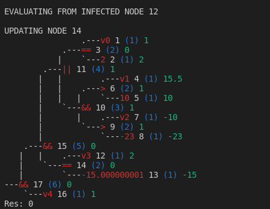

# Evaluator lib

A library which allows the computation of expressions in string format.

- At the moment it supports the following operators: `&&`, `||`, `!`, `==`, `>=`, `<=`
- All values are converted to `double`
- Calculation is performed starting from the root node when more than one node is infected (has a changed value)
- Calculation follows the less deep branch in order to optimize cases like `AND false`, `OR true`
- Whe only one leaf node is infected, calculation is performed from bottom to top and stops if it finds a node
which doesn't change its value, otherwise it continues until the root node.


## Usage

```
std::string expr = "(v0 == 2 || (v1 > 10  && v2 > -23)) && v3 == -15.000000001 && v4";
Evaluator eval{};
eval.compile(expr);

std::unordered_map<string, double> values;
values["v0"] = 1.0;
values["v1"] = 15.5;
values["v2"] = -10.0;
values["v3"] = -15.000000001;
eval.setValues(values);
eval.setValue("v4", true);
bool res = eval();
DEBUG("Res: " << res);
```

## Examples

The calculation exits immediately because of `AND false`



The calculation starts from the infected node and only performs its parent update, because the result does not change



## Resources:

- [https://en.wikipedia.org/wiki/Shunting-yard_algorithm](https://en.wikipedia.org/wiki/Shunting-yard_algorithm)
- [https://www.klittlepage.com/2013/12/22/twelve-days-2013-shunting-yard-algorithm/](https://www.klittlepage.com/2013/12/22/twelve-days-2013-shunting-yard-algorithm/)
- [https://www.techiedelight.com/c-program-print-binary-tree/](https://www.techiedelight.com/c-program-print-binary-tree/)
