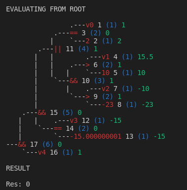

# Evaluator lib

A library which allows the computation of expressions in string format.

Work in progress...

Resources:

- [https://en.wikipedia.org/wiki/Shunting-yard_algorithm](https://en.wikipedia.org/wiki/Shunting-yard_algorithm)
- [https://www.klittlepage.com/2013/12/22/twelve-days-2013-shunting-yard-algorithm/](https://www.klittlepage.com/2013/12/22/twelve-days-2013-shunting-yard-algorithm/)
- [https://www.techiedelight.com/c-program-print-binary-tree/](https://www.techiedelight.com/c-program-print-binary-tree/)

